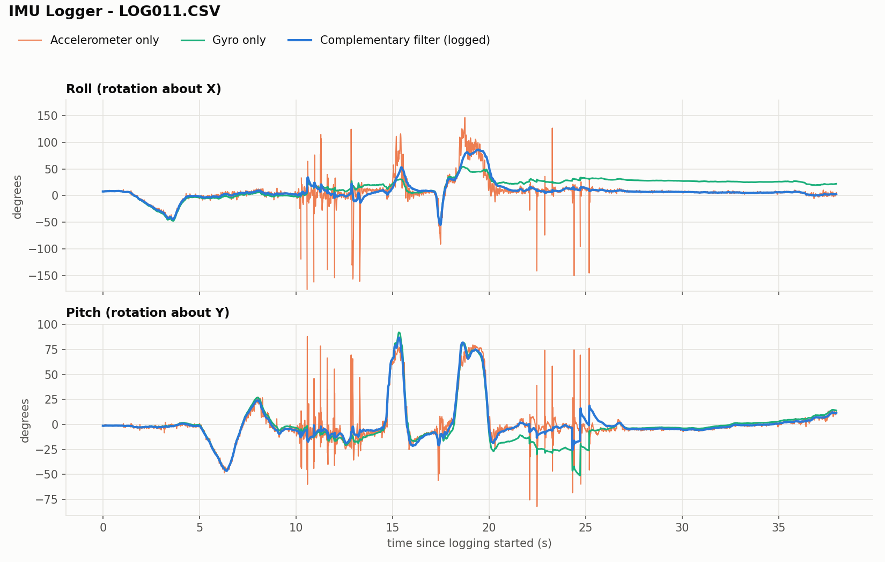

# IMU Logger — bare-metal STM32

Motion logger on an STM32F411 (NUCLEO-F411RE): reads an MPU-6050 accelerometer + gyroscope over I2C, fuses them into roll and pitch with a complementary filter, and logs 100 samples per second to a microSD card as CSV files a PC can open.

All peripheral drivers — GPIO, UART, I2C, SPI, the SD card protocol — are written **at the register level**, straight from the STM32 reference manual (RM0383), with no ST HAL in the data path. The only library is [FatFS](http://elm-chan.org/fsw/ff/) for the file system, connected through my own `diskio.c`.



Taps swing the raw accelerometer angle by ±150°; the filtered angle moves a fraction of that. At rest, gyro-only integration drifted 20° in 38 s while the filter stayed within 0.1° of the accelerometer. Plotted from a raw CSV log with `tools/plot_log.py`.

## What it does

- **100 Hz fixed-rate loop** timed by a 1 ms SysTick interrupt
- **Burst read** of all 14 MPU-6050 data bytes in one I2C transaction, so every axis comes from the same instant
- **Complementary filter** for roll and pitch (gyro short-term, accelerometer long-term), started at the accelerometer angle so there's no warm-up
- **CSV logging to microSD** (exFAT) — a new `LOGnnn.CSV` every boot, saved to the card once per second so a power cut loses at most 1 s
- **Survives faults:** every I2C wait is time-bounded; if the sensor wire comes loose or the sensor loses power, the logger re-initialises it and carries on, leaving a visible gap in the timestamps
- **Raw data logged**, so calibration and filtering can be redone on the PC afterwards

## Hardware

| Part | Notes |
|---|---|
| NUCLEO-F411RE | Cortex-M4F, 84 MHz; on-board ST-Link for flashing and serial |
| Adafruit MPU-6050 breakout | ±8 g accel, ±2000 °/s gyro |
| microSD card breakout | SPI; tested with a SanDisk High Endurance 128 GB (exFAT) |

### Wiring

| Signal | STM32 pin | Nucleo header |
|---|---|---|
| I2C1 SCL → MPU-6050 SCL | PB8 | D15 |
| I2C1 SDA → MPU-6050 SDA | PB9 | D14 |
| SPI1 SCK → SD CLK | PA5 | D13 |
| SPI1 MISO ← SD DO | PA6 | D12 |
| SPI1 MOSI → SD DI | PA7 | D11 |
| SD chip select | PB6 | D10 |
| USART2 TX/RX (debug, 115200 baud) | PA2 / PA3 | via ST-Link USB |

Power and ground for both breakouts come from the Nucleo's power header.

## Log format

```
ms,ax,ay,az,gx,gy,gz,roll_x100,pitch_x100
```

| Column | Meaning |
|---|---|
| `ms` | milliseconds since power-on (1 ms interrupt clock) |
| `ax ay az` | raw accelerometer counts — 4096 counts = 1 g |
| `gx gy gz` | raw gyro counts, bias removed — 16.4 counts = 1 °/s |
| `roll_x100`, `pitch_x100` | filtered angles × 100 (4523 = 45.23°) |

Angles are stored ×100 as integers because FatFS's `f_printf` doesn't print floats.

## Build and run

1. Open the project in **STM32CubeIDE** and build.
2. FatFS settings in `ffconf.h`: `FF_FS_EXFAT 1`, `FF_USE_LFN 1`, `FF_CODE_PAGE 437`, `FF_FS_NORTC 1`, `FF_USE_STRFUNC 1`.
3. Flash to the Nucleo with a card inserted. Startup status prints over the ST-Link serial port at 115200 baud.
4. **Stop logging (unplug) before re-flashing** — see Limitations.

## Plot a log

```
pip install pandas matplotlib numpy
python tools/plot_log.py docs/filter_demo.csv
```

Saves a PNG next to the CSV comparing accelerometer-only, gyro-only, and filtered angles.

## Things I had to debug

Every real bug is written up with symptom, root cause, fix and lesson. A few:

- **Peripheral init ran before the clock switch** — I2C and UART were configured for 16 MHz, then the PLL moved the bus to 42 MHz. My only passing test printed *before* the switch, so it proved nothing.
- **I2C BUSY flag latched high at power-on** (a documented F4 erratum) — found by bounding every wait and printing which stage failed; fixed with a peripheral software reset.
- **SD read gave up after 1 ms** — the spec allows 100 ms. The card was left mid-block, and the next boot's `CMD0` read its leftover data as `0x00`.
- **Sensor came back from a power cut asleep** — it still answered on I2C, so the code called it a success. Now an all-zero accelerometer counts as a failure, since an awake accelerometer always feels gravity.
- **Logging raw data exposed gyro saturation** at ±500 °/s — samples pinned at exactly ±32767 — so the range was raised to ±2000 °/s.

## Limitations

- **No yaw (heading)** — correcting it needs a magnetometer, which the MPU-6050 doesn't have.
- **Roll and pitch are separate filters**, so they break down near straight-up/down and during full flips (pitch is clamped to ±90°). A quaternion filter would fix this.
- **A card interrupted mid-write can stay stuck until power-cycled.** Firmware can't recover it; the planned PCB adds a switch on the card's power.
- SPI runs at 10.5 MHz, limited by jumper wires.

## Next

- Custom **KiCad shield** that plugs onto the Nucleo, replacing the jumper wires, with a GPIO-controlled power switch for the SD card
- Quaternion orientation filter
