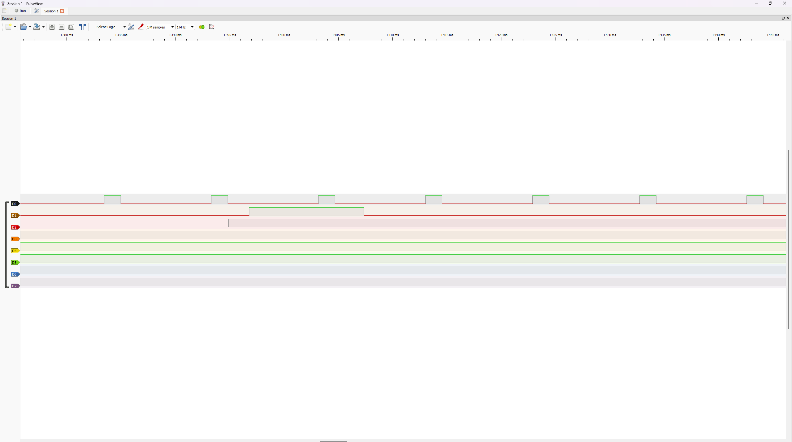
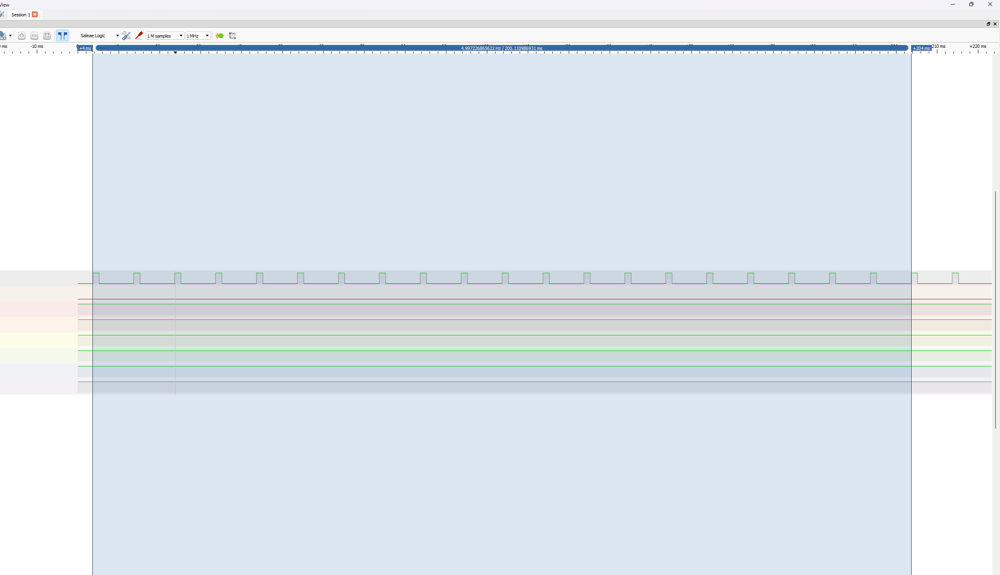

# IMU Logger: STM32 + FreeRTOS

A motion logger built on an STM32F411 (NUCLEO-F411RE). It reads an MPU-6050 accelerometer and gyroscope over I2C, combines them into roll and pitch angles with a complementary filter, and saves 100 samples per second to a microSD card as CSV files.

Every peripheral driver (GPIO, UART, I2C, SPI and the SD card protocol) is written **at the register level**, straight from the STM32 reference manual (RM0383). There is no ST HAL in the data path. The firmware runs as **three FreeRTOS tasks joined by queues**, so a slow SD card can never delay a sensor reading. The only libraries are [FreeRTOS](https://www.freertos.org/) and [FatFS](http://elm-chan.org/fsw/ff/) (connected through my own `diskio.c`).


Taps swing the raw accelerometer angle by ±150°, while the filtered angle barely moves. At rest, the gyro-only angle drifted 20° in 38 s, and the filter stayed within 0.1° of the accelerometer. Plotted from a raw CSV log with `tools/plot_log.py`.

## Features

- **Three FreeRTOS tasks**, joined by two queues. Sampling, filtering and SD writing run separately, ranked by how urgent they are (see Architecture).
- **100 Hz sampling with no drift.** `vTaskDelayUntil` wakes the sensor task exactly every 10 ms. In a 98 s test log, **8,297 of 8,299 sample gaps were exactly 10 ms**, with zero samples dropped.
- **Burst read** of all 14 MPU-6050 data bytes in one I2C transaction, so every axis comes from the same instant.
- **Complementary filter** for roll and pitch: the gyro is trusted short-term, the accelerometer long-term. It starts at the accelerometer angle, so there is no warm-up.
- **CSV logging to microSD** (exFAT). Each boot creates a new `LOGnnn.CSV`, and the file is saved to the card once per second, so a power cut loses at most 1 s of data.
- **Fault recovery.** Every I2C wait has a timeout. If a sensor wire comes loose or the sensor loses power, the logger re-initialises it and keeps going, leaving a visible gap in the timestamps.
- **Live health stats** over the serial port every second (queue backlog, dropped samples, sensor faults), plus each task's stack usage every 10 s.
- **Stack overflow detection.** If any task runs past the end of its stack, the board prints the task's name and halts, instead of silently corrupting memory.
- **Raw data is logged**, so calibration and filtering can be redone on a PC later.
- **Timing verified with a logic analyzer** (see below).

## Architecture

```
imu_task ──[imu_q, 16]──▶ filter_task ──[log_q, 64]──▶ sd_task ──▶ microSD
 prio 40                     prio 32                     prio 16
 never waits                 never waits                 allowed to be slow
```

| Task | Priority | Job | Sleeps until |
|---|---|---|---|
| `imu_task` | 40 (highest) | Burst-reads the MPU-6050. Re-initialises the sensor itself if a read fails | The next 10 ms slot (`vTaskDelayUntil`) |
| `filter_task` | 32 | Raw bytes → g, °/s, roll and pitch | A sample arrives in `imu_q` |
| heartbeat | 24 | Toggles a pin every 250 ms, to show the scheduler is alive | 250 ms pass |
| `sd_task` | 16 (lowest) | Writes CSV rows. Saves and prints stats every 1 s | A row arrives in `log_q`, or the next report is due |

**Design rules:**

- **Senders never wait.** If a queue is full, the item is dropped and counted, so sampling can't be held up by anything downstream.
- **Receivers wait forever** (`portMAX_DELAY`), so an idle task uses no CPU.
- **Only `imu_task` touches I2C.** It can reset the bus after a failed read with no locking, because nothing else can be mid-transfer.
- **SD writing is lowest priority.** When the card stalls, rows pile up in the 64-slot `log_q` (0.64 s of cushion) instead of delaying samples.

### Stack sizing, from measurement

Each task gets a fixed block of RAM for its stack. The first sizes were guesses. Then `uxTaskGetStackHighWaterMark` measured the least free stack each task ever had, and the stacks were resized to the measured use plus a safety margin.

| Task | First guess (words) | Measured peak use | Now | Margin |
|---|---|---|---|---|
| `imu_task` | 256 | 44 | **128** | 2.9× |
| `filter_task` | 512 | 96 | **256** | 2.7× |
| `sd_task` | 1024 | ~132 | **512** | 3.9×, extra because the SD card's heaviest path may not have run during the test |
| heartbeat | 128 | 28 | 128 | 4.6× |

The guesses were 4–8× too big. Resizing freed **3.5 KB**: the FreeRTOS heap's minimum free space went from 5,440 B to **9,024 B**, matching the prediction exactly. `configCHECK_FOR_STACK_OVERFLOW = 2` catches overflows at runtime.

## Verified with a logic analyzer

All measurements were taken with a 24 MHz, 8-channel logic analyzer and PulseView. Spare pins go high while specific work runs, so timing shows up next to the bus signals. Capture files (`.sr`, open in PulseView) and screenshots are in [`docs/captures/`](docs/captures/).

| What | Measured | Check |
|---|---|---|
| I2C clock | 10 µs period, **100 kHz** | Matches the configured speed |
| One 14-byte sensor read (Start to Stop) | **1.54 ms** | 17 bytes × 9 clocks × 10 µs = 1.53 ms |
| Sensor read period (FreeRTOS) | **10.000–10.001 ms** | After the clock fix below |
| Once-per-second save (`f_sync`) | **3.5–10.6 ms** | Varies with the card. The queues absorb it |
| One 512-byte SD block write | ~1.9 ms sending, then **~0.9 ms card busy** | Taken with SPI slowed to 2.6 MHz so the analyzer could decode it |

### Preemption: sampling never waits for the SD card

D0 = sensor read, D1 = SD save (`f_sync`), D2 = heartbeat. A sensor read fires right on schedule **in the middle of** a 10.6 ms SD save. FreeRTOS pauses the low-priority save, runs the high-priority read, then resumes the save where it left off.



### Clock accuracy

The chip originally ran on its internal RC oscillator (HSI). On the analyzer, 20 sample periods took **197 ms** instead of 200 ms: the whole board was running **1.5% fast**. The firmware couldn't notice, because its own timestamps are measured with the same clock. After switching to the 8 MHz crystal-derived clock from the on-board ST-Link (HSE bypass, PLL → 84 MHz), 20 periods measure **200.11 ms**.



### Sensor unplug test

With the MPU-6050 unplugged mid-run, the fault counter climbed by 100 per second (one retry every 10 ms). The log shows a **14,900 ms gap**, and the fault counter read **1,489** (× 10 ms = 14.89 s). Logging resumed in the same file with clean 10 ms steps.

### Bus traffic, decoded

**I2C sensor read.** Start, address `0x68` + write, register `0x3B`, repeated start, `0x68` + read, then 14 data bytes. Every byte is acknowledged except the last one, which gets a NACK, followed by Stop. This matches `mpu_read_burst()` line for line, including the timing-sensitive NACK on the final byte.


**SD card block write.** `58` is CMD24 ("write one block"), followed by the block number and the `FE` start token. After that comes the CSV text itself, in ASCII. The card answers `E5` ("data accepted"), then holds its output low while it writes to flash.


### Before FreeRTOS: why it was needed

The bare-metal version ran everything in one 10 ms loop. Its once-per-second `f_sync` pass took 5.3 ms, which fit. But the SD spec allows a single write to stall for up to ~250 ms, and in a single loop that would stop sampling and lose about 25 readings. That's what the task split fixes.


## Hardware

| Part | Notes |
|---|---|
| NUCLEO-F411RE | Cortex-M4F, 84 MHz, on-board ST-Link for flashing, serial and the 8 MHz clock |
| Adafruit MPU-6050 breakout | ±8 g accelerometer, ±2000 °/s gyro |
| microSD card breakout | SPI, tested with a SanDisk High Endurance 128 GB card (exFAT) |

### Wiring

| Signal | STM32 pin | Nucleo header |
|---|---|---|
| I2C1 SCL to MPU-6050 SCL | PB8 | D15 |
| I2C1 SDA to MPU-6050 SDA | PB9 | D14 |
| SPI1 SCK to SD CLK | PA5 | D13 |
| SPI1 MISO from SD DO | PA6 | D12 |
| SPI1 MOSI to SD DI | PA7 | D11 |
| SD chip select | PB6 | D10 |
| Debug pin: high during each sensor read | PA8 | D7 |
| Debug pin: high during each SD save (`f_sync`) | PA9 | D8 |
| Debug pin: heartbeat, toggles every 250 ms | PA10 | D2 |
| USART2 TX/RX (debug, 115200 baud) | PA2 / PA3 | Via ST-Link USB |
| MPU-6050 VIN | Power | 3V3 |
| MPU-6050 GND | Ground | GND |
| SD reader VCC | Power | 5V |
| SD reader GND | Ground | GND |

## Log format

```
ms,ax,ay,az,gx,gy,gz,roll_x100,pitch_x100
```

| Column | Meaning |
|---|---|
| `ms` | Milliseconds since the scheduler started (FreeRTOS tick, taken at each read) |
| `ax ay az` | Raw accelerometer counts: 4096 counts = 1 g |
| `gx gy gz` | Raw gyro counts with bias removed: 16.4 counts = 1 °/s |
| `roll_x100`, `pitch_x100` | Filtered angles × 100 (4523 means 45.23°) |

Angles are stored as integers × 100 because FatFS's `f_printf` can't print floats.

## Serial output

```
file LOG040.CSV open 0
tasks running
imuq 1 logq 1 drop 0/0 fault 0
...
stack free (words): imu 84 filter 160 sd 382 hb 100 | heap min free (bytes): 9024
```

`imuq` / `logq` are the worst backlog seen in each queue, `drop` counts samples/rows thrown away because a queue was full, and `fault` counts failed sensor reads.

## Build and run

1. Open the project in **STM32CubeIDE** and build. FreeRTOS is configured through STM32CubeMX (CMSIS_V2 interface, HAL timebase on TIM1, HSE bypass clock).
2. FatFS settings in `ffconf.h`: `FF_FS_EXFAT 1`, `FF_USE_LFN 1`, `FF_CODE_PAGE 437`, `FF_FS_NORTC 1`, `FF_USE_STRFUNC 1`.
3. Flash the Nucleo with a card inserted. Startup status prints over the ST-Link serial port at 115200 baud.
4. **Stop logging (unplug) before re-flashing.** See Limitations.

## Plot a log

```
pip install pandas matplotlib numpy
python tools/plot_log.py docs/filter_demo.csv
```

This saves a PNG next to the CSV comparing the accelerometer-only, gyro-only and filtered angles.

## Bugs I tracked down

Every real bug is written up with its symptom, root cause, fix and lesson. Some highlights:

- **The whole board ran 1.5% fast, and the firmware couldn't tell.** Its timestamps were measured with the same internal RC clock, so the CSV looked perfect. Only the logic analyzer, with its own crystal, showed 20 periods taking 197 ms. Switching to the ST-Link's crystal-derived 8 MHz fixed it.
- **Peripherals were set up before the clock changed.** I2C and UART were configured for 16 MHz, then the PLL switched the bus to 42 MHz. My only passing test printed *before* the switch, so it proved nothing.
- **The I2C BUSY flag latched high at power-on**, a documented F4 erratum. I found it by adding a timeout to every wait and printing which step failed, then fixed it with a peripheral software reset.
- **SD reads gave up after 1 ms**, but the spec allows 100 ms. The card was left mid-transfer, and on the next boot `CMD0` read its leftover data as `0x00`.
- **The sensor came back from a power cut asleep.** It still answered on I2C, so the code treated it as working. Now an all-zero accelerometer reading counts as a failure, because an awake accelerometer always feels gravity.
- **Logging raw data revealed gyro saturation** at ±500 °/s: samples stuck at exactly ±32767. I raised the range to ±2000 °/s.
- **The logic analyzer broke the bus it was measuring.** With its USB unplugged, its inputs pulled the SPI lines down, and the SD card replied `0xC1`. That reply is impossible, since a valid one always starts with a 0 bit. The rule now: power the analyzer first, then clip it on.

## Limitations

- **The sensor task busy-waits on I2C** for about 1.55 ms per read, roughly 15% of the CPU spent waiting. DMA is next.
- **No yaw (heading).** Correcting it needs a magnetometer, which the MPU-6050 doesn't have.
- **Roll and pitch use separate filters**, so they break down near straight up or down and during full flips. Pitch is clamped to ±90°. A quaternion filter would fix this.
- **A card interrupted mid-write can stay stuck until it is power-cycled.** Firmware can't recover it, so the planned PCB adds a switch on the card's power.
- **The 8 MHz clock comes from the ST-Link chip.** Running without the ST-Link powered (on battery, for example) still needs checking.
- **SPI runs at 10.5 MHz**, limited by the jumper wires.

## Roadmap

- **DMA** for the I2C read, freeing the ~1.5 ms the CPU currently spends waiting on it
- **Custom shield PCB** that plugs onto the Nucleo, replacing the jumper wires, with a GPIO-controlled power switch for the SD card and a socket for an ESP32-C6 radio
- **Over-the-air firmware updates** through the ESP32-C6 (Wi-Fi), then mounting the logger on a drone
- **Quaternion orientation filter**
